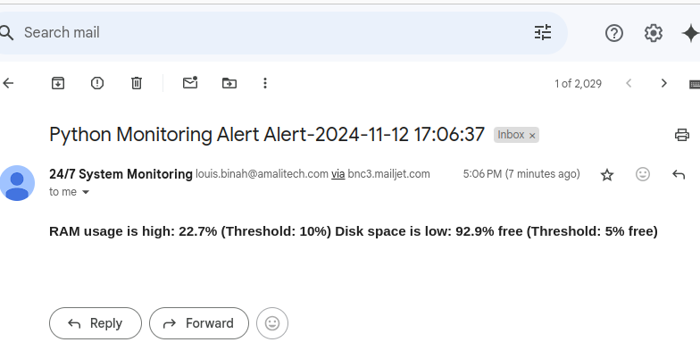

# python_system_monitoring_lab

1. **Clone the Repository:**
   ```bash
    https://github.com/BINAH25/python_system_monitoring_lab.git
    cd python_system_monitoring_lab

2. **Create Virtual Environment:**
   ```bash
   python -m venv venv
   source venv/bin/activate  # On Windows, use `venv\Scripts\activate`

3. **Install the requires packages:**
   ```bash
   pip install -r requirements.txt


4. **Create an info.py file:**
   ```bash
    touch info.py
    Configure your API AND SECRET KEY
    API_KEY = 'your api key'
    SECRET_KEY = 'your secret key'


5. **Run the Application:**
   ```bash
    python3 system_monitor.py
    verify your email for notification
    
